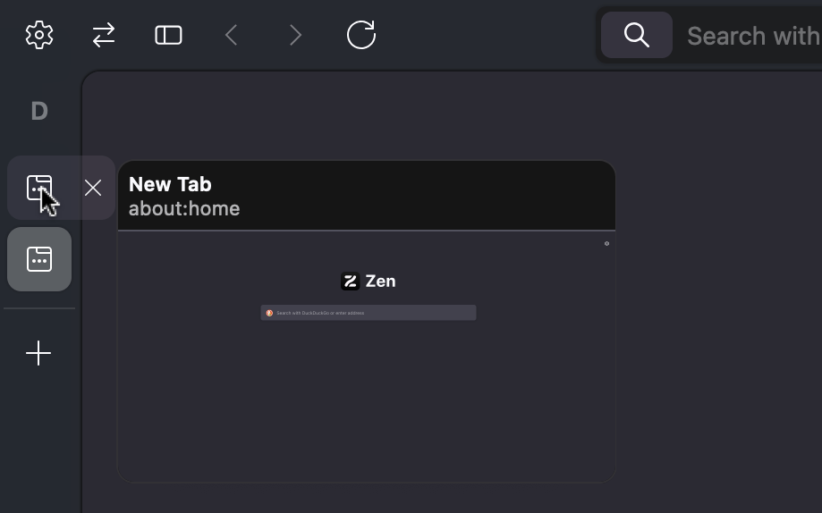

# Zen Collapsed Close Tab

This mod for [Zen Browser](https://zen-browser.app) shows closed tab buttons when hovering over tabs when the tab bar is collapsed. It works with the tab bar on either side of the window.

## Installation

1. Open https://zen-browser.app/mods in the Zen Browser
2. Search for "Collapsed Close Tab"
3. Click "Install Theme"

## Quirks

The scrollbar for tabs appears on the outside edge of the window, instead of always appearing on the right edge. This is so that tabs can extend over the content area when hovered over.

This mod was confirmed to be compatible with the built-in color themes, but user-installed themes may cause unexpected tab colors. The background under hovered tabs may appear strange if the tab bar background is not a solid color.

This relies on a niche CSS bug to set the `pointer-events` style on the correct elements, and therefore is at (low) risk of being unable to interact with the scrollable portion of the tab bar at some point in the future.
